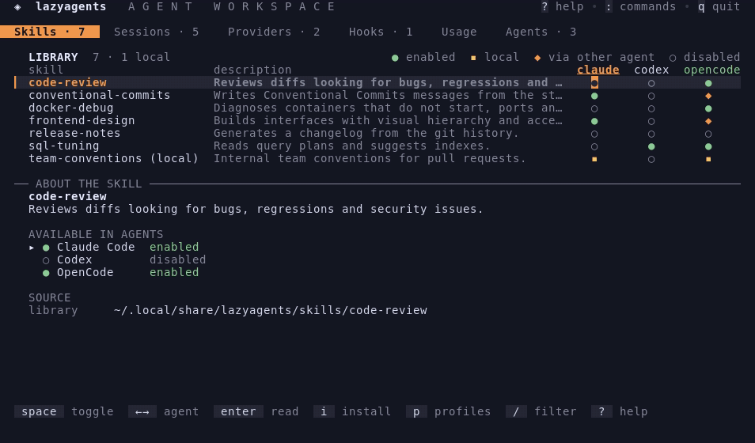

<p align="center"></p>

<h1 align="center">lazyagents</h1>

<p align="center"><strong>The lazygit for AI coding agents.</strong></p>

<p align="center">Claude Code · Codex · Gemini CLI · OpenCode · Pi · Crush · Hermes Agent</p>

<p align="center"><a href="https://github.com/rogeriojunior31/lazyagents/actions/workflows/ci.yml"></a></p>

<p align="center"></p>

```sh
go install github.com/rogeriojunior31/lazyagents@latest
```

Or grab a binary for Linux, macOS or Windows from [Releases](https://github.com/rogeriojunior31/lazyagents/releases).

## Why

Every coding agent keeps its own copy of everything:

```text
~/.claude/       skills · sessions · config
~/.codex/        skills · sessions · config
~/.gemini/       skills · sessions · config
~/.pi/agent/     skills · sessions · config
…
```

Install a skill in one and the others never see it. Last week's session is in some agent's history, and you have to remember which. Each agent shows its limits in a different place. lazyagents puts all of it in one terminal: **one skill library linked into every agent, one session history, one place for limits, providers and hooks.** Agent support varies; see [what each agent supports](docs/reference/agents.md). Claude Desktop is detected only.

## What it does

- **[Skills](docs/guide/skills.md):** a skill is a folder with a `SKILL.md` of instructions that an agent loads when a task matches ([Agent Skills](https://agentskills.io)). lazyagents keeps one library for every agent. Install from GitHub, a folder or a zip, then enable each skill per agent with a keypress, or in all of them at once. Enabling is a symlink, so nothing is copied or lost. Also covers adopting local skills, profiles, updates from the source and backups.
- **[Sessions](docs/guide/sessions.md):** one history across Claude Code, Codex, Gemini CLI, OpenCode, Pi and Crush. Resume any session in its own CLI and folder, read transcripts as a log (the answer first, steps folded, edits and failed commands marked, subagents one key away), search across all of them, give them aliases, clean up with backups.
- **[Usage](docs/guide/usage.md):** subscription limits (session and weekly windows, reset times) and token consumption by day, agent, project and model.
- **[Providers](docs/guide/providers.md):** endpoint and model profiles applied to each agent's live config, cc-switch style, with a preview of every change and a backup before writing. Tokens are never shown.
- **[Hooks](docs/guide/hooks.md):** a hook library installed per agent, including hooks shipped by skill repositories. Hooks you wrote yourself are left alone.
- **[Plugins](docs/guide/plugins.md):** any executable in the plugins dir becomes a tab, a command and a `doctor` section. Plugins can be written in any language.
- **Headless CLI** with `--json` for scripts and for the agents themselves ([reference](docs/reference/cli.md)).

Inspired by lazygit and [cc-switch](https://github.com/farion1231/cc-switch).

> lazyagents is pre-1.0: it is used daily, but commands and file formats may still change between minor versions. Changes are recorded in the [CHANGELOG](CHANGELOG.md).

## Try it with popular skills

Install once, use it in every agent. `--all` enables what was installed in every agent lazyagents finds; skill names after the repository install only those.

```sh
lazyagents install DietrichGebert/ponytail --all        # the laziest solution that works
lazyagents install tt-a1i/archify archify --all         # architecture diagrams
lazyagents install mattpocock/skills tdd grill-me --all # two of Matt Pocock's skills
```

Leave out `--all` to only add them to the library and choose the agents in the Skills tab.

## Install

```sh
go install github.com/rogeriojunior31/lazyagents@latest
```

Or download a binary from [Releases](https://github.com/rogeriojunior31/lazyagents/releases) for Linux, macOS or Windows, with `SHA256SUMS` to verify.

The test suite runs on Linux, macOS and Windows in CI; day-to-day use is on Linux, so reports from the other systems are very welcome. On Windows, enabling skills needs permission to create symlinks (Developer Mode).

## Quick start

```sh
lazyagents doctor              # what agents and skills lazyagents sees
lazyagents                     # open the TUI: tab switches tabs, ? shows the keys, q quits
lazyagents install user/repo   # install skills from a GitHub repository
lazyagents enable my-skill --agent claude-code
lazyagents sessions --here     # sessions started in this folder
lazyagents usage               # limits and consumption
```

The [getting started guide](docs/getting-started.md) walks through it in five minutes.

## A longer tour


## Documentation

Browse it on the web at **[rogeriojunior31.github.io/docs/lazyagents](https://rogeriojunior31.github.io/docs/lazyagents/)**, updated with every release. A Brazilian Portuguese translation is in progress in [docs/pt-br](docs/pt-br/README.md).

| | |
|---|---|
| [Getting started](docs/getting-started.md) | Install, first skill, first resumed session |
| [Guides](docs/README.md#guides) | Skills, sessions, usage, providers, hooks, agents, plugins |
| [Configuration](docs/configuration.md) · [Themes](docs/themes.md) | `config.yaml`, tab layout, file locations, 14 built-in themes and your own |
| [Safety and data](docs/safety.md) | What lazyagents writes, backups and restore, secrets, network |
| [Troubleshooting](docs/troubleshooting.md) | Common problems and fixes |
| [Reference](docs/README.md#reference) | Every command, key, agent capability and theme, generated from the code |

## How it stays safe

lazyagents only changes an agent's files when you act. Config writes are confirmed in the TUI and backed up first, keys it does not manage are preserved, and a real skill folder is never deleted. Tokens are stored with mode 0600 and never displayed unless you ask with `provider list --reveal`. There is no network call at startup and no telemetry. Details: [Safety and data](docs/safety.md).

## Contributing

Issues and pull requests are welcome: see [CONTRIBUTING](CONTRIBUTING.md) and the [architecture overview](docs/architecture.md). Security issues go through [SECURITY](SECURITY.md). Planned work is in [BACKLOG.md](BACKLOG.md).

## License

[MIT](LICENSE). The themes come from [SP Night](https://sp-night.github.io/) and community palettes, under their own licenses ([notices](internal/tui/theme/LICENSES-themes.md)).
