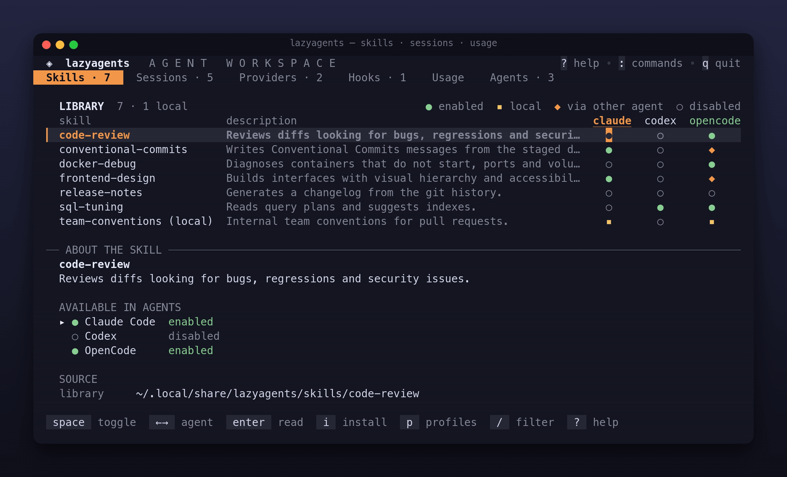
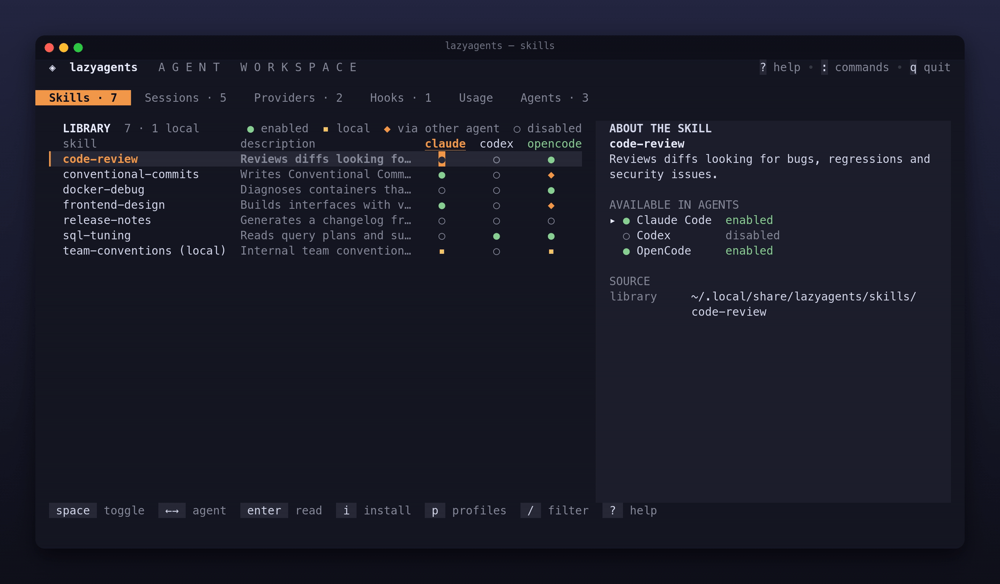
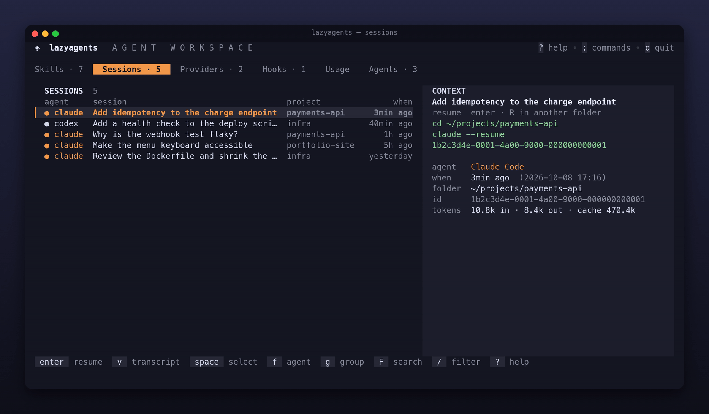
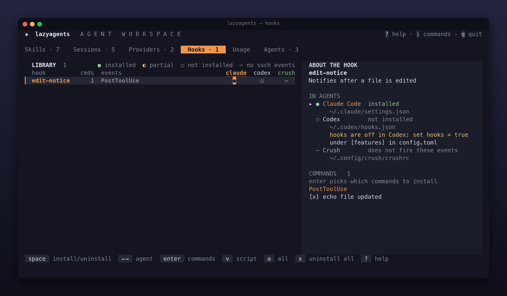
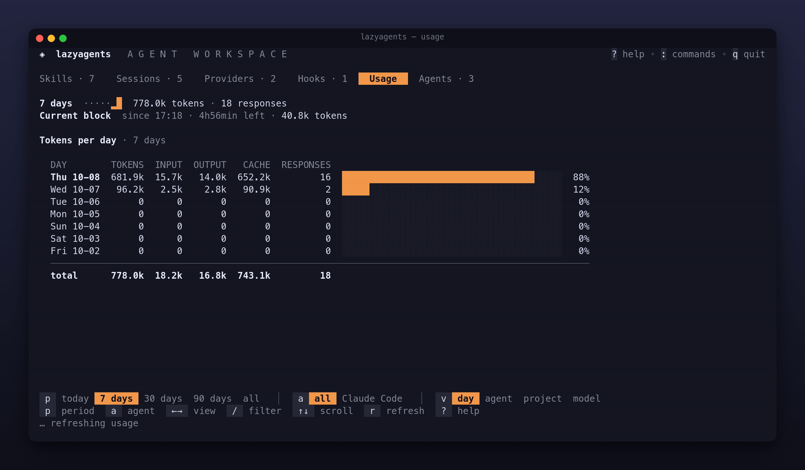

<p align="center"></p>

<h1 align="center">lazyagents</h1>

<p align="center"><strong>O lazygit dos agentes de código com IA.</strong><br>Skills, sessões, consumo, providers e hooks de todos os agentes num terminal só.</p>

<p align="center">Claude Code · Codex · Gemini CLI · OpenCode · Pi · Crush · Hermes Agent</p>

<p align="center">
  <a href="https://github.com/rogeriojunior31/lazyagents/actions/workflows/ci.yml"></a>
  <a href="https://github.com/rogeriojunior31/lazyagents/releases"></a>
  <a href="https://rogeriojunior31.github.io/docs/lazyagents/"></a>
</p>

<p align="center"><a href="README.md">English</a> · <b>Português</b></p>

<p align="center"></p>

## Instalação

```sh
go install github.com/rogeriojunior31/lazyagents@latest
```

Ou baixe um binário para Linux, macOS ou Windows em [Releases](https://github.com/rogeriojunior31/lazyagents/releases). Depois rode:

```sh
lazyagents          # abre a TUI: tab troca de aba, ? mostra as teclas, q sai
lazyagents doctor   # quais agentes e skills o lazyagents encontra
```

## 📖 Documentação

<p align="center"><a href="https://rogeriojunior31.github.io/docs/lazyagents/"><strong>rogeriojunior31.github.io/docs/lazyagents</strong></a></p>

Tudo sobre como usar o lazyagents está na documentação, com busca e atualizada a cada release:

- **[Primeiros passos](https://rogeriojunior31.github.io/docs/lazyagents/getting-started/)**: instalação, primeira skill e primeira sessão retomada em cinco minutos.
- **[Guias](https://rogeriojunior31.github.io/docs/lazyagents/#guias)**: skills, sessões, consumo, providers, hooks, agentes e plugins.
- **[Teclas](https://rogeriojunior31.github.io/docs/lazyagents/reference/keys/)** e **[CLI](https://rogeriojunior31.github.io/docs/lazyagents/reference/cli/)**: todas as teclas e comandos.
- **[Segurança e dados](https://rogeriojunior31.github.io/docs/lazyagents/safety/)**: o que o lazyagents grava, backups, segredos, rede.
- **[Solução de problemas](https://rogeriojunior31.github.io/docs/lazyagents/troubleshooting/)**: problemas comuns e como resolver.

## Tour

<table>
<tr>
<td width="50%"><a href="https://rogeriojunior31.github.io/docs/lazyagents/guide/skills/"></a><br><b>Skills</b> · uma biblioteca, ativada por agente com uma tecla</td>
<td width="50%"><a href="https://rogeriojunior31.github.io/docs/lazyagents/guide/sessions/"></a><br><b>Sessions</b> · o histórico de todos os agentes, com busca e leitura como log</td>
</tr>
<tr>
<td width="50%"><a href="https://rogeriojunior31.github.io/docs/lazyagents/guide/providers/"></a><br><b>Providers</b> · perfis de API e de modelo local</td>
<td width="50%"><a href="https://rogeriojunior31.github.io/docs/lazyagents/guide/hooks/"></a><br><b>Hooks</b> · um comando, todos os agentes</td>
</tr>
<tr>
<td width="50%"><a href="https://rogeriojunior31.github.io/docs/lazyagents/guide/usage/"></a><br><b>Usage</b> · limites e tokens por dia, agente e projeto</td>
<td width="50%"><a href="https://rogeriojunior31.github.io/docs/lazyagents/guide/agents/"></a><br><b>Agents</b> · o que foi detectado</td>
</tr>
</table>

Cada clipe abre o seu guia.

> O lazyagents ainda é pré-1.0: é usado no dia a dia, mas comandos e formatos de arquivo ainda podem mudar entre versões menores. Veja o [CHANGELOG](CHANGELOG.md).

## Contribuindo

Issues e pull requests são bem-vindos: veja o [CONTRIBUTING](CONTRIBUTING.md). Questões de segurança vão pelo [SECURITY](SECURITY.md).

## Licença

[MIT](LICENSE). Os temas vêm do [SP Night](https://sp-night.github.io/) e de paletas da comunidade, sob as próprias licenças ([avisos](internal/tui/theme/LICENSES-themes.md)).
