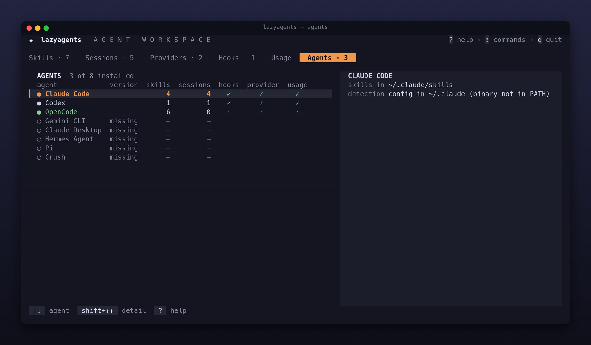

# Agentes
<!-- source: 0bdc0e861439 -->

A aba Agents oferece uma visão somente leitura de todos os agentes conhecidos: se estão instalados, qual a versão e o que o lazyagents pode gerenciar. Use-a para entender por que um agente não aparece em outra aba ou onde ficam suas skills.

O suporte de cada agente (diretórios, provedores, hooks, limites e eventos) é gerado do código na [referência dos agentes](../reference/agents.md). Aqui você encontra a explicação da aba.

## A tabela

Uma linha por agente, com os instalados primeiro:

| Coluna na interface | Significado |
|---|---|
| agent | nome na cor do agente; `○` e texto discreto se não instalado |
| version | primeira linha de `<cli> --version` |
| skills | skills ativadas; `—` se não houver diretório local de skills |
| sessions | sessões do agente encontradas no disco |
| hooks · provider · usage | `✓` quando é possível gerenciar hooks, aplicar perfil de provedor ou ler consumo |

O contador da aba é o número de agentes instalados. Em terminais com menos de 75 colunas, as três colunas de recursos passam para uma linha `manages` no detalhe. Em terminais largos, o detalhe fica ao lado da tabela.

## Painel de detalhes

Para o agente selecionado:

- **skills in:** diretório onde o lazyagents cria os links de skills.
- **reads too:** outros diretórios lidos pelo agente. Uma skill ali aparece mesmo sem ativação pelo lazyagents.
- **detection:** caminho do binário, ou diretório de configuração se o binário não estiver no `PATH`.
- **(shared):** diretório compartilhado, como `~/.agents/skills`. O link fica ali só enquanto a skill estiver ativada para todos os agentes instalados que o leem; veja [diretórios compartilhados](skills.md#concepts).

Um agente não instalado mostra apenas a orientação de instalar sua CLI e reabrir o lazyagents.

## Como funciona a detecção

- O agente conta como instalado se o binário estiver no `PATH` **ou** seu diretório de configuração existir, como `~/.claude` ou `~/.codex`. Com apenas o diretório, o detalhe avisa que o binário não está no `PATH`: skills e sessões ainda funcionam, mas retomar exige a CLI.
- A versão vem de `<cli> --version`, executado uma vez em segundo plano ao iniciar a TUI, com até 6 segundos por CLI. Na CLI do lazyagents, só comandos que precisam da versão, como `doctor`, fazem essa consulta.
- Claude Desktop é detectado apenas pelo diretório de configuração. Skills e conversas ficam na conta claude.ai; não há conteúdo local para gerenciar.
- Hermes Agent ativa skills em `~/.hermes/skills` (`%LOCALAPPDATA%\hermes\skills` no Windows), no perfil de `hermes profile use` ou em `HERMES_HOME`. Também lê `skills.create_dir` e `skills.external_dirs` de `config.yaml`, resolvendo `~`, `${VAR}` e caminhos relativos como o Hermes. Diretórios inexistentes ficam de fora. Incluir `~/.agents/skills` torna Hermes participante desse compartilhamento.
- Pi usa `~/.pi/agent` ou `PI_CODING_AGENT_DIR`. Como outras ferramentas também têm um binário `pi`, sem esse diretório o binário só conta se `pi --version` imprimir apenas uma versão.
- Agentes movidos por suas variáveis (`CLAUDE_CONFIG_DIR`, `CODEX_HOME`, `XDG_DATA_HOME` para OpenCode…) são encontrados ali se o lazyagents executar com o mesmo ambiente. Veja a [referência de variáveis](../reference/agents.md#config-overrides).
- Crush conta como instalado pelo binário, `~/.config/crush` ou `~/.local/share/crush`. Lê skills em `~/.config/crush/skills` (onde são ativadas), `~/.config/agents/skills`, `~/.claude/skills` e `~/.agents/skills`. Se houver `CRUSH_SKILLS_DIR`, usa somente esse diretório, onde o lazyagents também ativa as skills.

A detecção ocorre uma vez por execução. Reabra o lazyagents após instalar uma CLI.

Na CLI, `lazyagents doctor` mostra a mesma detecção na primeira seção; `--json` inclui a versão.

## Teclas

`↑/↓` seleciona o agente e `shift+↑/↓` rola os detalhes. Veja a [referência completa](../reference/keys.md#agents-tab).

## Solicitar um novo agente

O suporte usa um adaptador em `internal/agent`, único lugar que conhece caminhos e formatos dos agentes. Para solicitar um, abra uma issue com nome, locais de skills, sessões e configuração, e links da documentação. Para implementar, veja [Adicionar um agente](../architecture.md#adding-an-agent).
