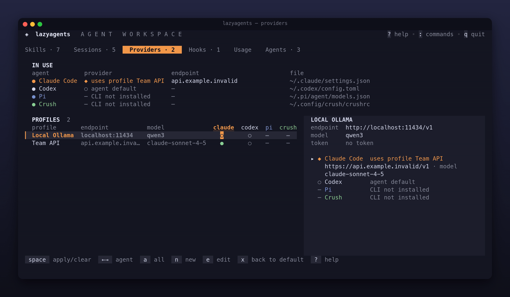

# Provedores
<!-- source: 3d07687b6f6e -->

Um perfil de provedor define endpoint, modelo e token com um nome. O lazyagents escreve esses valores na configuração do agente para alternar Claude Code ou Codex entre API oficial, proxy e modelo local sem editar JSON/TOML manualmente. Funciona como [cc-switch](https://github.com/farion1231/cc-switch): só altera configuração, nunca executa um proxy. Agentes compatíveis e arquivos estão na [referência](../reference/agents.md#capabilities).



<a id="concepts"></a>

## Conceitos

- **Perfil:** `name`, `baseUrl`, `model`, `token`, `envKey` e `wireApi`. Precisa definir pelo menos endpoint, modelo ou token. Nomes têm até 40 caracteres.
- **Biblioteca:** `~/.config/lazyagents/providers.json`, com modo `0600`, pois pode conter tokens.
- **Aplicado:** estado atual da configuração do agente, lido diretamente do arquivo. Uma configuração manual também aparece como provedor definido fora do lazyagents. A correspondência com a biblioteca usa endpoint e também modelo se dois perfis compartilharem o endpoint.
- **Limpar:** remove apenas o que o lazyagents gerencia e restaura o estado anterior. O resto fica intacto.

<a id="in-the-tui"></a>

## Na TUI

A aba Providers é uma matriz perfil × agente: `●` aplicado, `○` padrão do agente e `–` agente não instalado. O detalhe mostra endpoint, modelo, estado do token (`token ✓`, nunca o valor) e configuração aplicada por agente. Veja as [teclas](../reference/keys.md#providers-tab).

<a id="create-a-profile"></a>

### Criar um perfil

`n` abre o formulário com nome, endpoint, modelo, token, variável de ambiente e API. `tab` troca de campo e `enter` salva. O token fica mascarado. `e` edita o perfil: deixar o token vazio mantém o salvo, que nunca é carregado no formulário. Renomear também renomeia na biblioteca.

<a id="apply-or-clear-per-agent"></a>

### Aplicar ou limpar por agente

Escolha a coluna com `←/→` e pressione `space`. A confirmação mostra arquivo, endpoint atual e novo (`agent default → https://…`). Repetir no perfil já aplicado limpa. `a` aplica em todos os agentes compatíveis e `x` limpa de todos. `d` remove da biblioteca, mas não desfaz configurações já aplicadas; use `x` ou limpe por agente.

<a id="what-is-written-to-claude-code"></a>

### O que é escrito no Claude Code

Três chaves no bloco `env` de `~/.claude/settings.json`:

```json
{
  "theme": "dark",
  "env": {
    "ANTHROPIC_AUTH_TOKEN": "sk-…",
    "ANTHROPIC_BASE_URL": "https://proxy.example.com",
    "ANTHROPIC_MODEL": "my-model"
  }
}
```

Só essas chaves mudam. Outras variáveis e chaves mantêm valor e ordem; novas chaves ficam no fim de `env`. O lazyagents lembra quais escreveu e só remove as próprias:

- Um campo vazio não muda uma chave definida manualmente. Se foi escrita por um perfil anterior, é removida: trocar para perfil sem modelo retira o modelo antigo.
- Se substituir endpoint ou modelo manual, limpar restaura o valor anterior. Tokens manuais não são guardados pelo lazyagents; permanecem no backup de `settings.json`.
- Chaves editadas por você após a aplicação passam a ser suas e não são removidas.
- Se o lazyagents criou `env` e ele ficar vazio, limpar remove também o bloco. Aplicar e limpar devolve o arquivo original.

O registro fica em `~/.local/share/lazyagents/claude-provider-state.json` (0600) e contém apenas a impressão digital dos valores escritos, nunca o token. Sem registro (nenhuma aplicação ou perfil de v0.2 ou anterior), nenhuma chave é considerada gerenciada: `x` as preserva, sem apagar configurações manuais de proxy ou Bedrock. Remova manualmente resíduos de versões antigas; os backups preservam o arquivo anterior.

Ao escrever um token, a permissão do arquivo passa a `0600`.

<a id="what-is-written-to-codex"></a>

### O que é escrito no Codex

Codex mantém estado próprio em `~/.codex/config.toml`, como confiança em `[projects.*]` e hashes de hooks. O lazyagents não interpreta nem reescreve o arquivo inteiro. Só edita blocos entre marcadores `# lazyagents — managed block`, preservando as outras linhas:

```toml
# lazyagents — managed block start (do not edit by hand)
model_provider = "lazyagents"
model = "qwen3"
# lazyagents: previous model = "gpt-5"
# lazyagents — managed block end

[projects."/home/me/app"]
trust_level = "trusted"

# lazyagents — managed block start (do not edit by hand)
[model_providers.lazyagents]
name = "local"
base_url = "http://localhost:11434/v1"
env_key = "OLLAMA_KEY"
wire_api = "responses"
# lazyagents — managed block end
```

Os comentários do exemplo são marcadores reais do programa e devem permanecer exatamente assim. Chaves globais ficam antes da primeira tabela; a tabela do provedor vai ao fim. Os valores anteriores de `model` e `model_provider` são guardados como comentários e restaurados ao limpar. Aplicar e limpar devolve o original.

Para Codex, o perfil exige endpoint. `wireApi` só aceita `responses`, também padrão do Codex.

### Pi

Pi guarda provedores personalizados em `~/.pi/agent/models.json`. O lazyagents escreve o provedor `lazyagents` e o define como padrão em `~/.pi/agent/settings.json` (`defaultProvider` e `defaultModel`). Os demais valores ficam intactos:

```json
{
  "providers": {
    "lazyagents": {
      "name": "lazyagents: local",
      "baseUrl": "http://localhost:11434/v1",
      "api": "openai-completions",
      "apiKey": "$OLLAMA_KEY",
      "models": [{ "id": "qwen3" }]
    }
  }
}
```

Pi só disponibiliza modelos declarados pelo provedor; o perfil precisa de endpoint e modelo. `wireApi` escolhe a API: vazio ou `chat` para chat compatível com OpenAI, `responses` para OpenAI Responses, `anthropic` para Anthropic Messages. Provedor e modelo padrão anteriores ficam nos dados do lazyagents e são restaurados ao limpar, salvo se você já tiver escolhido outro no Pi. Um `models.json` criado pelo perfil é removido na limpeza.

### Crush

`crushrc` é um script Bash com comandos como `provider add` e `model large`, executado de cima para baixo; linhas posteriores prevalecem. O lazyagents acrescenta um bloco ao fim de `~/.config/crush/crushrc` (ou diretório de `CRUSH_GLOBAL_CONFIG`) sem alterar suas linhas:

```bash
# lazyagents — managed block start: provider (do not edit by hand)
provider add lazyagents --name 'lazyagents: local' --type openai-compat --base-url 'http://localhost:11434/v1' --api-key "$OLLAMA_KEY"
model add 'lazyagents/qwen3' --name 'qwen3'
model large 'lazyagents/qwen3'
# lazyagents — managed block end: provider
```

Os comentários também são marcadores reais, não texto a traduzir na configuração. Como é o último, `model large` do bloco prevalece. Limpar remove o bloco e volta a usar suas linhas, sem restauração adicional. Valores usam aspas simples para impedir execução como Bash; variáveis usam `"$VAR"` para o Crush expandir. O perfil exige endpoint e modelo; `wireApi` aceita vazio, `chat` (compatível com OpenAI) ou `anthropic`. Um `crushrc` criado pelo lazyagents é removido junto com o bloco. Se houver `crush.json` na mesma pasta, Crush combina os dois, dá preferência ao `crushrc` e registra um aviso.

<a id="tokens-and---env-key"></a>

### Tokens e --env-key

Claude Code lê o token de `settings.json`, então ele é escrito ali. Codex só lê a variável indicada por `env_key`, nunca recebe token em `config.toml`. Pi aceita os dois: token em `models.json` com modo 0600, ou `"apiKey": "$VAR"`, resolvido pelo próprio Pi. Pi esconde modelos sem credencial, então perfis sem chave, como Ollama local, recebem `"apiKey": "lazyagents-no-key"`, conforme a convenção do Pi. No Codex, defina a variável no perfil (`--env-key`) e exporte no shell:

```sh
export OLLAMA_KEY=…   # no perfil do seu shell
```

Aplicar no Codex um perfil com token, mas sem `envKey`, falha com explicação em vez de criar configuração sem autenticação.

<a id="from-the-cli"></a>

## Pela CLI

```sh
# proxy para Claude Code; token pela entrada padrão, fora do histórico do shell
pass show work/proxy-token | lazyagents provider add proxy \
  --base-url https://proxy.example.com --model my-model --token -

# modelo local para Codex
lazyagents provider add local --base-url http://localhost:11434/v1 \
  --model qwen3 --env-key OLLAMA_KEY --wire-api responses

lazyagents provider apply proxy --agent claude-code
lazyagents provider apply local --agent codex
lazyagents provider list            # tokens como •••• ou $VAR para envKey
lazyagents provider list --json     # sem tokens; usa "hasToken": true
lazyagents provider clear           # todos os agentes instalados
lazyagents provider rm proxy
```

Sem `--agent`, `apply` e `clear` atuam em todos os agentes compatíveis. Falhas de um não impedem os outros; os erros são reunidos. Veja os [comandos e flags](../reference/cli.md#provider).

<a id="files"></a>

## Arquivos

| Caminho | Conteúdo |
|---|---|
| `~/.config/lazyagents/providers.json` | biblioteca de perfis, 0600 |
| `~/.local/share/lazyagents/claude-provider-state.json` | chaves `env` escritas no Claude Code, só impressões digitais, 0600 |
| `~/.claude/settings.json` | bloco `env` do Claude Code |
| `~/.codex/config.toml` | blocos gerenciados do Codex |
| `~/.local/share/lazyagents/backups/` | `settings.json.<timestamp>` e `config.toml.<timestamp>`, 20 mais recentes de cada |

<a id="safety"></a>

## Segurança

- Toda aplicação e limpeza copia o arquivo do agente ao backup com as mesmas permissões e grava atomicamente por arquivo temporário e renomeação.
- Tokens ficam mascarados: `token ✓` na TUI, `••••` em `provider list` e campo omitido em JSON. Só `provider list --reveal` imprime o valor.
- Toda escrita pela TUI pede confirmação com o arquivo.
- `doctor` informa configuração aplicada por agente e aponta provedores em agentes não instalados ou arquivos ilegíveis.

<a id="limits"></a>

## Limitações

- Apenas Claude Code, Codex, Pi e Crush suportam provedores. Outros só aparecem em `provider list` quando implementarem o recurso.
- Strings multilinha (`"""` ou `'''`) e arrays multilinha em TOML são preservados: linhas internas não são tratadas como chaves, tabelas ou marcadores. Strings/arrays não terminados, blocos quebrados ou aninhados e `[model_providers.lazyagents]` manual fora do bloco gerenciado são recusados, sem alterar o arquivo.
- Perfis aplicados são identificados por endpoint e modelo. Dois com os mesmos valores são indistinguíveis.
